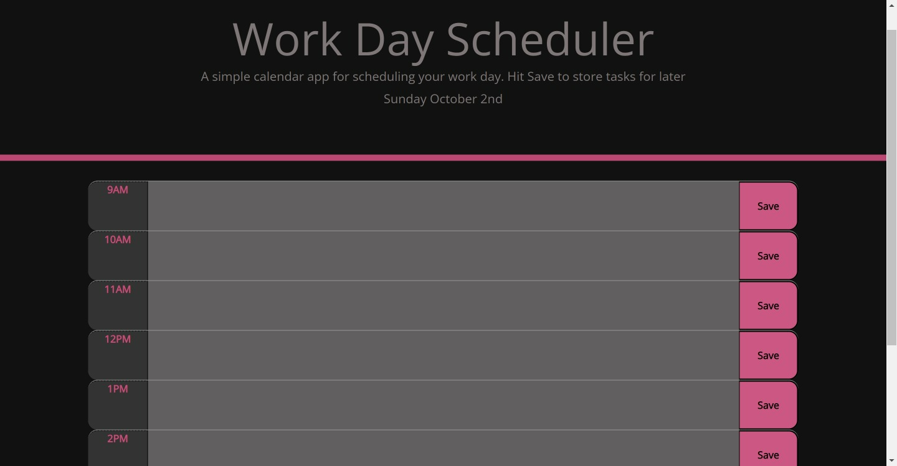

# Daily-Schedule-Calender

Description:

This repository contains a daily workday calender built using HTML, CSS, javascript, and JQUERY. The Calender allows you to save things hourly and the blocks change colors based on whether they are in the past, present or future. Entries are stored in local storage so they will persist throughout the day.

Links:

[Deployed Website](https://thedanbrown.github.io/Daily-Schedule-Calender/)
[Repository](https://github.com/Thedanbrown/Daily-Schedule-Calender)

Usage:

once deployed, the webpage can be viewed in a traditional browser. 

License:

MIT License

Copyright (c) [2020] [Pete Kriengsiri]

Permission is hereby granted, free of charge, to any person obtaining a copy of this software and associated documentation files (the "Software"), to deal in the Software without restriction, including without limitation the rights to use, copy, modify, merge, publish, distribute, sublicense, and/or sell copies of the Software, and to permit persons to whom the Software is furnished to do so, subject to the following conditions:

The above copyright notice and this permission notice shall be included in all copies or substantial portions of the Software.

THE SOFTWARE IS PROVIDED "AS IS", WITHOUT WARRANTY OF ANY KIND, EXPRESS OR IMPLIED, INCLUDING BUT NOT LIMITED TO THE WARRANTIES OF MERCHANTABILITY, FITNESS FOR A PARTICULAR PURPOSE AND NONINFRINGEMENT. IN NO EVENT SHALL THE AUTHORS OR COPYRIGHT HOLDERS BE LIABLE FOR ANY CLAIM, DAMAGES OR OTHER LIABILITY, WHETHER IN AN ACTION OF CONTRACT, TORT OR OTHERWISE, ARISING FROM, OUT OF OR IN CONNECTION WITH THE SOFTWARE OR THE USE OR OTHER DEALINGS IN THE SOFTWARE.